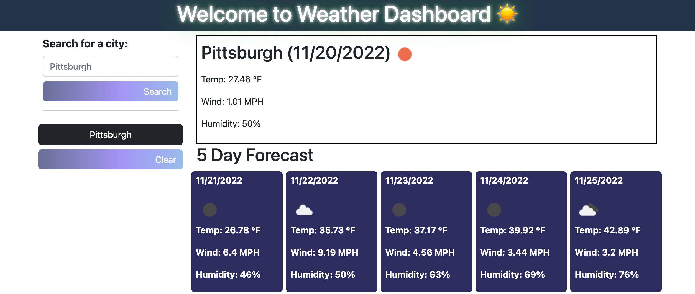

# weather-dashboard

## Description

This is a weather dashboard. This project was made using HTML, CSS, Javascript, and the 
Open Weather API. It also uses DayJS library to get information about the current day. The project uses
localstorage to store the users searched cities in an array of buttons on the side. The previous
searched cities can be clicked any time to view the current weather and the 5 day forecast.
The localstorage can also be cleared by clicking the clear button.

## Usage
[Deployed Link]()  
[Github Repo]()

## Credits

Bootstrap CSS Framework  
Day JS library  
Open Weather API  

